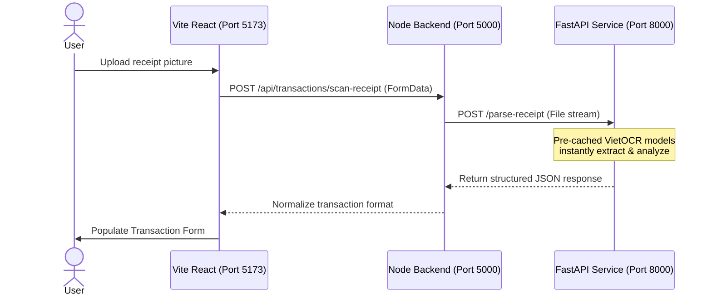

# GR1 Savings Helper

Welcome to the **Savings Helper** repository. This project consists of three decoupled layers working seamlessly together:
1. **OCR Microservice** (Python/FastAPI) - Persistent NLP & Computer Vision analysis.
2. **Backend API** (Node.js/Express) - Application logic, database interactions, and gateway.
3. **Frontend Client** (Vite/React) - User Interface.

---

## 🚀 Running the Services Separately

To start development, you will need to open **three separate terminal instances** (one for each service) and follow these commands:

---

### 1️⃣ Python OCR Microservice (Port 8000)
This service holds pre-loaded machine learning models (PaddleOCR + VietOCR) in memory to parse and structure uploaded receipts near-instantly.

**Setup & Activation (Windows):**
```powershell
# 1. Navigate to the service directory
cd ocr_service

# 2. Activate the dedicated virtual environment
.venv\Scripts\activate

# 3. (Optional) To sync new packages if requirements changed:
uv pip install paddlepaddle paddleocr vietocr groq fastapi uvicorn python-multipart python-dotenv
```

**Run standalone:**
```powershell
python app.py
```
> 💡 **Note**: You will see models pre-loading into memory on boot. Once initialized, you can query status at `http://localhost:8000/health`.

---

### 2️⃣ Node.js Express Backend (Port 5000)
Acts as your central database gateway, authentication engine, and proxies OCR image traffic to the Python service.

**Setup & Run:**
```powershell
# 1. Navigate to the backend directory
cd backend

# 2. Ensure dependencies are installed
pnpm install

# 3. Start the development server (using nodemon)
pnpm run dev
```
> 💡 **Gateway Config**: The Node API automatically routes receipt images to the python endpoint on port 8000 via Axios.

---

### 3️⃣ Vite React Frontend (Port 5173)
The user interface used to track finances and submit receipt scans.

**Setup & Run:**
```powershell
# 1. Navigate to the frontend directory
cd frontend

# 2. Ensure dependencies are installed
pnpm install

# 3. Start the React application
pnpm run dev
```

---

## 📊 Architecture Overview & API Communication Flow



## 🛠️ Configuration Variables (.env files)
Ensure your local environments have the following settings:

* **`ocr_service/.env`**:
  ```env
  PORT=8000
  GROQ_API_KEY=your_gsk_key_here
  ```
* **`backend/.env`**:
  ```env
  PORT=5000
  DATABASE_URL=file:./prisma/dev.db
  GROQ_API_KEY=your_gsk_key_here
  ```
